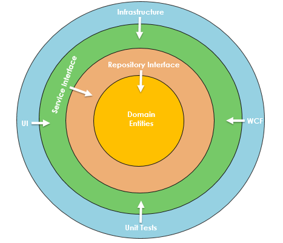

# Introduction

`serverless-cqrs` is collection tools to help you get started with building a fully functioning backend based on the principles of [CQRS](https://docs.microsoft.com/en-us/azure/architecture/patterns/cqrs), [Event Sourcing](http://www.cqrs.nu/Faq/event-sourcing), [Domain Driven Design](https://medium.com/the-coding-matrix/ddd-101-the-5-minute-tour-7a3037cf53b8), and [Onion Architecture](https://www.codeguru.com/csharp/csharp/cs_misc/designtechniques/understanding-onion-architecture.html).

The goal is twofold: 

* Write as little boilerplate code as possible.
* Clean service boundaries so that parts can be easily tested and swapped out.

## Background

Event Sourcing is an **exciting** new way to build applications. Actually, it's _not_ new. Some of these concepts have been around for decades. But recent trends in **serverless** computing and **microservice** architectures have made it relevant once again and, perhaps, more accessible than ever!

#### Microservices

The idea behind microservices is to break up monolithic applications into distinct services, each with clear service boundaries and specific concerns. This helps with testing, reasoning about changes, and can help to prevent coupling.

Microservices still need to communicate with each other to coordinate work. One way they do this is through a **stream of events**. As each service performs a task, it broadcasts the event to other service which can choose to react and perform their own task in response.

For example, a **payment service** might listen for `orderCreated` events from the **order service** and react by charging the user. If the charge is successful, it \(the service\) will broadcast a `paymentSuccess` event which then triggers the **fulfillment service** to do something, and so on...

Event sourcing fits naturally into this flow by bringing events front-and-center in the lifecycle of your entities. Because all events are captured and are immutable, services that go offline, or otherwise loose the continuity of the event stream, can simply pick up where they left off. Furthermore, as new services come online they can request the event history in order to populate their initial state.

## Definitions

#### CQRS \(Command-Query Responsibility Separation\)

CQRS is a pattern for architecting applications so that the model responsible for writing data is completely separate and independent from the model responsible for reading data. This is useful when working with complex business logic, event-based systems, or when you need to scale reads and writes independently.  

Further reading: [https://docs.microsoft.com/en-us/azure/architecture/patterns/cqrs](https://docs.microsoft.com/en-us/azure/architecture/patterns/cqrs), [https://martinfowler.com/bliki/CQRS.html](https://martinfowler.com/bliki/CQRS.html)

#### Event Sourcing \(ES\)

Event Sourcing is another architecture pattern which works very well with CQRS. The basic idea is that instead storing the current state of an object, you store all the changes \(events\) which brought it to this state. By storing data this way, your application can easily evolve and adapt to new business requirements. At any moment, you can change the way you interpret events and replay all past events to get an updated view of your system. 

This isn't as inefficient as you might think, you can read more about it here: [http://www.cqrs.nu/Faq/event-sourcing](http://www.cqrs.nu/Faq/event-sourcing)

#### Domain Driven Design \(DDD\)

Domain Driven Design is a design pattern puts 'domain experts' at the forefront of the design process. Through a collaborative process, we map the domain using language and service boundaries that closely match the real world. We come out with a ubiquitous language,  aggregate and value objects, bounded contexts, and some other concepts that help us define this map. 

Further reading: [https://www.infoq.com/minibooks/domain-driven-design-quickly](https://www.infoq.com/minibooks/domain-driven-design-quickly), [https://medium.com/the-coding-matrix/ddd-101-the-5-minute-tour-7a3037cf53b8](https://medium.com/the-coding-matrix/ddd-101-the-5-minute-tour-7a3037cf53b8)

####  Onion Architecture

Onion Architecture is a way of layering your code to minimize coupling and make it easy to test. Layers have a strict dependency rule where outer layers can depend on inner layers, but inner layers may not know anything about outer layers. Layers communicate with each other via well defined interfaces making them easy to test in isolation and swap components.

* At the very center, you have your domain which describes the business logic of your application.
* Around your domain, you have a repository layer which handles data persistence.
* Next you have a service interface which provides read/write access.
* Finally, you have the different services which might interact with your application.

Further reading: [https://www.codeguru.com/csharp/csharp/cs\_misc/designtechniques/understanding-onion-architecture.html](https://www.codeguru.com/csharp/csharp/cs_misc/designtechniques/understanding-onion-architecture.html)

